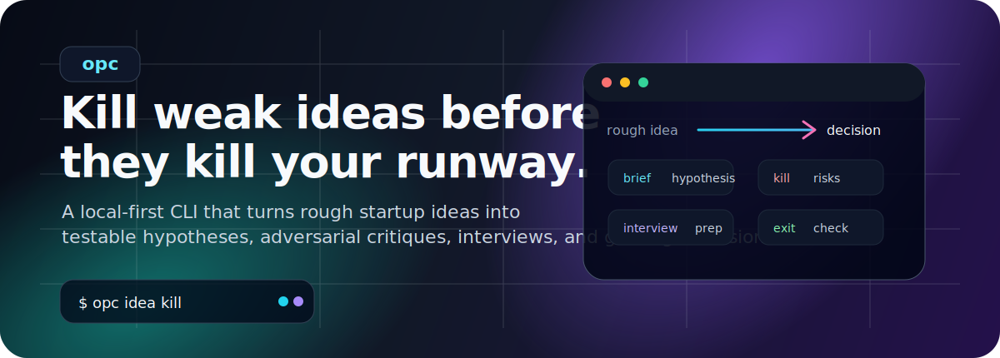
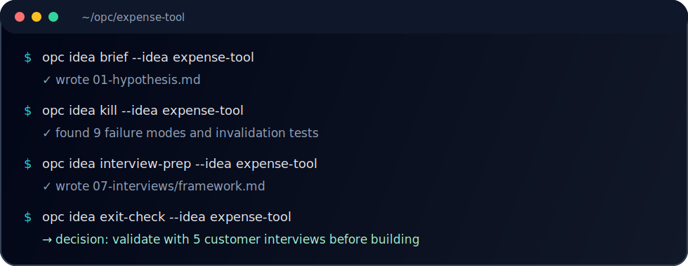

<p align="center">
  
</p>

<p align="center">
  <strong>Idea-stage CLI for AI-native solo founders.</strong><br />
  Turn a rough startup idea into a testable hypothesis, adversarial critique, interview plan, and go/no-go decision — without leaving your terminal.
</p>

<p align="center">
  <a href="#quick-start">Quick start</a> ·
  <a href="#why-opc">Why opc</a> ·
  <a href="#workflow">Workflow</a> ·
  <a href="#commands">Commands</a> ·
  <a href="#examples">Examples</a>
</p>

<p align="center">
  
  
  
</p>

---

## Why opc

Most builders do not need more feature ideas. They need a faster way to decide **which ideas deserve time**.

`opc` operationalizes the **Idea stage** from Anthropic's [Founder's Playbook](https://anthropic.com/founders-playbook): it uses an LLM as a structured devil's advocate to pressure-test your thinking before you start coding.

Use it when you want to:

- sharpen a vague idea into a falsifiable hypothesis;
- expose hidden risks, weak assumptions, and fake demand;
- prepare better customer interviews;
- decide whether to continue, pivot, or kill the idea.

<p align="center">
  
</p>

## Quick start

```bash
bun install && bun link

# Pick an LLM provider by setting one API key, or use Ollama locally.
export OPENAI_API_KEY="..."

opc init
opc idea new expense-tool
opc idea brief --idea expense-tool
opc idea kill --idea expense-tool
opc idea interview-prep --idea expense-tool
opc idea exit-check --idea expense-tool
```

`opc` writes plain Markdown files to `~/opc/<idea-slug>/`, so your idea work stays local, portable, and easy to version.

## Workflow

```text
rough idea
   │
   ▼
01-hypothesis.md       make the idea specific and falsifiable
   │
   ▼
02-kill.md             attack the idea before the market does
   │
   ▼
07-interviews/         prepare and audit customer discovery questions
   │
   ▼
exit-check.md          continue / pivot / kill decision
```

## Commands

| Command | Output | What it does |
|---|---|---|
| `opc init` | `~/opc/.config/opc.json` | Bootstrap provider/model config |
| `opc idea new <slug>` | `~/opc/<slug>/README.md` | Create a new idea workspace |
| `opc idea brief` | `01-hypothesis.md` | Convert rough notes into a testable hypothesis |
| `opc idea kill` | `02-kill.md` | Generate adversarial critique and invalidation tests |
| `opc idea interview-prep` | `07-interviews/framework.md` | Build a customer interview framework |
| `opc idea interview-audit <file>` | `07-interviews/audit/<name>.md` | Flag leading, vague, or future-facing questions |
| `opc idea exit-check` | `exit-check.md` | Evaluate whether the idea deserves more work |

All idea commands support `--idea <slug>`.

## Providers

Set one environment variable and `opc` auto-detects the provider:

| Env var | Provider | Default model |
|---|---|---|
| `OPENAI_API_KEY` | OpenAI | `gpt-4o` / `gpt-4o-mini` |
| `ANTHROPIC_API_KEY` | Anthropic | `claude-sonnet-4-20250514` / `claude-haiku-4-5-20251001` |
| `DEEPSEEK_API_KEY` | DeepSeek-compatible | `deepseek-chat` |
| `GROQ_API_KEY` | Groq-compatible | `llama-3.3-70b` / `llama-3.1-8b` |
| none | Ollama local | `llama3.2` |

Configure explicitly:

```bash
opc init --provider openai --model gpt-4o
```

Example config:

```json
{
  "provider": "openai",
  "model": "gpt-4o",
  "fast_model": "gpt-4o-mini"
}
```

## Idea workspace layout

```text
~/opc/<idea-slug>/
├── README.md               # raw idea notes
├── 01-hypothesis.md        # opc idea brief
├── 02-kill.md              # opc idea kill
├── 07-interviews/
│   ├── framework.md        # opc idea interview-prep
│   └── audit/<name>.md     # opc idea interview-audit
└── exit-check.md           # opc idea exit-check
```

## Examples

Demo workspaces live in [`examples/`](examples/):

- [`examples/sample-idea/`](examples/sample-idea/) — English sample idea workspace
- [`examples/demo-idea.bak/`](examples/demo-idea.bak/) — Chinese demo idea workspace backup

## Design principles

- **Local first** — no telemetry, no auth, no network calls except your chosen LLM provider.
- **Markdown on disk** — outputs are portable files, not a trapped SaaS workspace.
- **Provider agnostic** — OpenAI, Anthropic, DeepSeek, Groq, Ollama, or any OpenAI-compatible endpoint.
- **Sharp prompts over heavy abstractions** — prompt templates are plain Markdown with simple interpolation.

## Roadmap

Next idea-stage commands:

`competitors`, `reviews`, `market-size`, `trends`, `interview-debrief`, `interview-synth`, `solution-stress`, `proto-spec`.
